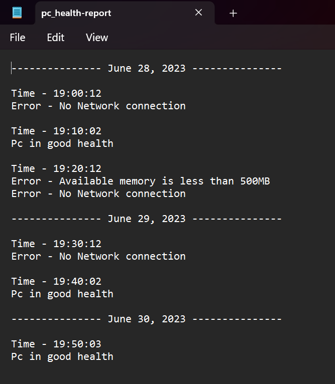

# PC Health Check Cron Job

<!-- 

    

 -->
![product name screenshot][report_screenshot]

## Description

The PC Health Check is a Python script designed to perform various health checks on a computer and generate a report. It includes checks for CPU usage, available disk space, available memory, network connection, and pending reboot status. The script can be executed as a cron job to enable regular monitoring of the computer's health.

> Note: The script was developed and tested on Ubuntu Linux. However, with some modifications, it can also be made to work on Windows.

## Features

- Checks CPU usage, available disk space, available memory, network connection, and pending reboot status.
- Generates a report with timestamps indicating the time of each - check.
- Saves the report to a text file for easy access and reference.

## Built With

- ![python.com][python_logo]
- ![shell][Shell Script]

## Prerequisites

- Modules:
  - `shutil`
  - `os`
  - `socket`
  - `psutil`

## Getting Started

1. Clone the repository.
2. Ensure that Python 3 is installed on your system.
3. Install the required modules by running `pip install psutil`.
4. Set up the cron job by executing the `create_cron-job.sh` shell script provided.

## Usage

1. **Set up the cron job:**
   - Run the `set_con-job.sh` script provided to add the `pc_health_check.py` script as a cron job.
   - The cron job is scheduled to run every ten minutes (*/10 * * * *).
   - Start the cron service by running one of the following commands, depending on your system:
       - For Ubuntu or Debian-based systems: `sudo service cron start`
       - For systems using systemd: `sudo systemctl start cron`

2. **Customization (optional):**
   - You can modify the cron schedule by editing the `newjob` variable in the `set_con-job.sh` script. *Example: to schedule the cron to run every hour (`0 * * * *`)
   - Adjust the health check conditions and messages in the main script to suit your specific requirements.

3. **Execution:**
    For cron job:
    The health check script will be automatically executed according to the cron schedule.
    The script will perform the specified health checks and generate a report.

    Manually:
    - Open a terminal and navigate to the project directory.
    - Run the main script by executing the following command: python pc_health_check.py.
    - The script will perform the specified health checks and generate a report.

4. **Report:**
   - If executed manually the report is saved in the `pc_health_check` directory in a text file named `pc_health-report.txt` in the same directory as the script.
   - If executed as cron job, the report is saved in the `pc_health_check` directory in a text file named `pc_health-report.txt` in the `/home` directory.
   - Each report includes the date and time of the check, as well as any error messages for failed checks.
   - If the script is executed for the first time or on a new date, a separator line with the date will be added for clarity.  

## Module: date_helper.py

The `date_helper.py` module is a local module included in the project. It provides functions for managing date-related operations in the PC Health Check script. The module includes the following functions:

`write_date_file(date, file_name)`: Writes the given date to a file specified by `file_name`.
`get_date(date_file)`: Retrieves the date from the specified `.date_file`.
`current_date()`: Returns a dictionary containing the current date and time. It checks if a file named `.today_date` exists and compares the stored date with the current date to determine if a new date has occurred.
> Note: The date_helper.py module is used internally by the PC Health Check script to handle date-related functionality. It ensures that the script generates appropriate timestamps in the report and separates reports based on different dates.

<!-- links -->
[report_screenshot]: images/report_shot.png
[python_logo]: https://img.shields.io/badge/Python-3.9-3776AB.svg?style=flat&logo=python&logoColor=white
[python.com]: https://www.python.org
[Shell Script]: https://img.shields.io/badge/shell_script-%23121011.svg?style=for-the-badge&logo=gnu-bash&logoColor=white